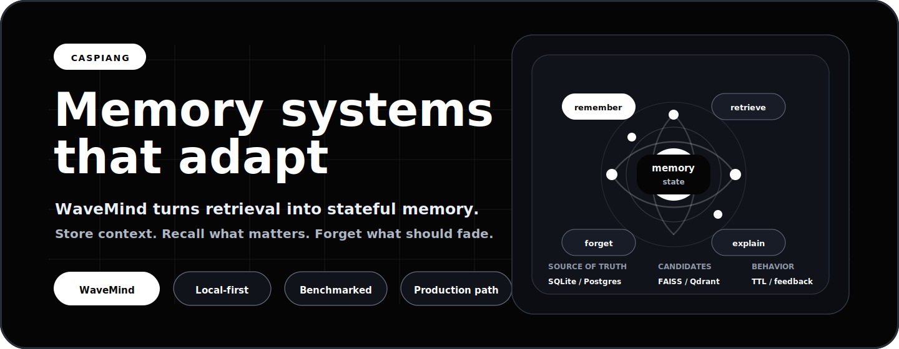
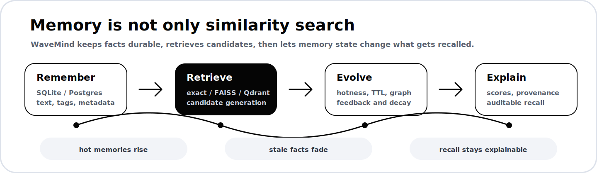

  

<h1 align="center">CaspianG</h1>

  <strong>Building memory infrastructure for software that needs to remember, adapt, and stay explainable over time.</strong>

  
  
  
  

  <a href="https://github.com/CaspianG/wavemind"><strong>WaveMind</strong></a>
  &nbsp;&middot;&nbsp;
  <a href="https://pypi.org/project/wavemind/">PyPI</a>
  &nbsp;&middot;&nbsp;
  <a href="https://github.com/CaspianG/wavemind#user-content-quick-start">Quick Start</a>
  &nbsp;&middot;&nbsp;
  <a href="https://github.com/CaspianG/wavemind#user-content-benchmark">Benchmarks</a>
  &nbsp;&middot;&nbsp;
  <a href="https://github.com/CaspianG/wavemind/issues">Issues</a>

---

<table>
  <tr>
    <td width="55%" valign="top">
      <h2>Current Focus</h2>
      

        My main project is <a href="https://github.com/CaspianG/wavemind"><strong>WaveMind</strong></a>,
        an open-source memory layer where recall is not just vector search, but a changing state.
      

      

        It combines durable storage, candidate retrieval, hotness, decay, TTL, namespaces,
        feedback, graph signals, and reproducible benchmark evidence.
      

      

        The goal is simple: software should not only find old context. It should know what still matters.
      

    </td>
    <td width="45%" valign="top">
      <h2>Try WaveMind</h2>
      <pre><code>pip install wavemind
wavemind quickstart
wavemind studio</code></pre>
      

        CLI, Python API, HTTP API, local Studio UI, persistent storage, vector backends,
        workers, telemetry, and checked benchmark reports.
      

    </td>
  </tr>
</table>

  

## What I Build

| Area | Direction |
| --- | --- |
| **Dynamic memory** | Systems that rank context by relevance, recency, feedback, priority, and decay. |
| **Retrieval infrastructure** | Local-first search, vector backends, persistent stores, benchmarks, and latency profiles. |
| **Agent tooling** | Practical integrations for Python, HTTP, LangChain, LlamaIndex, notebooks, and local apps. |
| **Production evidence** | Tests, reproducible reports, claim boundaries, dashboards, and release-ready documentation. |

## Selected Projects

| Project | What it is | Links |
| --- | --- | --- |
| **WaveMind** | Dynamic memory engine with CLI, HTTP API, Studio, workers, persistent storage, vector backends, benchmarks, and integrations. | [Repo](https://github.com/CaspianG/wavemind) · [PyPI](https://pypi.org/project/wavemind/) |
| **focus-flow** | Minimal desktop focus timer for deep-work sessions with planning, themes, session tracking, and English/Russian UI. | [Repo](https://github.com/CaspianG/focus-flow) |
| **CORECITY** | Browser game concept built around a living market mechanic driven by players. | [Repo](https://github.com/CaspianG/CORECITY) |

## Stack

  
  
  
  
  
  
  
  
  

## Open For

| Collaboration | Good fit |
| --- | --- |
| **Benchmarks** | Long-memory evaluation, stale-fact suppression, retrieval quality, latency, cost efficiency, and agent-impact tests. |
| **Integrations** | LangChain, LangGraph, LlamaIndex, CrewAI, AutoGen, local apps, notebooks, and migration paths from static vector search. |
| **Product feedback** | Real workflows where memory needs to evolve, forget, explain, or preserve user-specific context over time. |

## Contact

Open a thread in [WaveMind issues](https://github.com/CaspianG/wavemind/issues) if you want to test the project, contribute an integration, add a benchmark, or discuss dynamic memory for production software.
