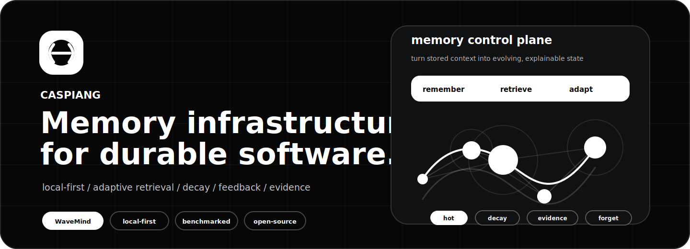
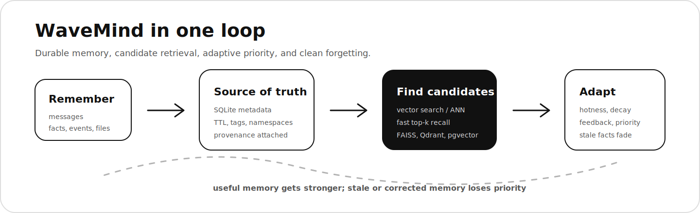

<p align="center">
  <a href="https://github.com/CaspianG/wavemind">
    
  </a>
</p>

<h2 align="center">Building memory infrastructure for software that should remember what matters.</h2>

<p align="center">
  <a href="https://github.com/CaspianG/wavemind">WaveMind</a>
  /
  <a href="https://pypi.org/project/wavemind/">PyPI</a>
  /
  <a href="https://github.com/CaspianG/wavemind#quick-start">Quick start</a>
  /
  <a href="https://github.com/CaspianG/wavemind#benchmarks">Benchmarks</a>
  /
  <a href="https://github.com/CaspianG/wavemind/issues">Issues</a>
</p>

<p align="center">
  <a href="https://github.com/CaspianG/wavemind"></a>
  <a href="https://pypi.org/project/wavemind/"></a>
  <a href="https://github.com/CaspianG/wavemind/actions"></a>
  <a href="https://github.com/CaspianG/wavemind/releases"></a>
</p>

---

## Current Focus

I am building [WaveMind](https://github.com/CaspianG/wavemind): a local-first memory layer for agents and applications.

Most memory systems stop at vector search. WaveMind adds lifecycle and behavior around memory: hotness, decay, TTL, namespaces, reinforcement, consolidation, service APIs, and benchmarks.

```python
from wavemind import WaveMind

memory = WaveMind()
memory.remember("The user prefers short technical answers.", namespace="user")

result = memory.query("How should I answer?", namespace="user")[0]
print(result.text)
```

<p align="center">
  <a href="https://github.com/CaspianG/wavemind">
    
  </a>
</p>

## What I Build

| Area | Work |
| --- | --- |
| Dynamic memory | Agent memory that adapts with usage instead of staying a static vector table |
| Retrieval systems | Vector search, reranking, namespaces, TTL, decay, and production query paths |
| Benchmarks | Reproducible checks for recall, latency, scale readiness, and memory behavior |
| Developer tools | Simple APIs, CLI flows, FastAPI services, examples, and integrations |

## Featured Projects

| Project | Status | Why it matters |
| --- | --- | --- |
| [WaveMind](https://github.com/CaspianG/wavemind) | Active | Dynamic long-term memory for agents and apps |
| [focus-flow](https://github.com/CaspianG/focus-flow) | Stable | Minimal desktop focus timer I use myself for focused work; simple and effective |

## Principles

- Useful recall is more important than nearest-neighbor recall.
- Local-first should be easy, but production paths should be real.
- Benchmarks should separate evidence from claims.
- A good developer experience should fit in minutes, not days.

## Stack

<p>
  
  
  
  
  
  
  
  
</p>

## Start Here

If you are looking for the main project, start with [CaspianG/wavemind](https://github.com/CaspianG/wavemind).
