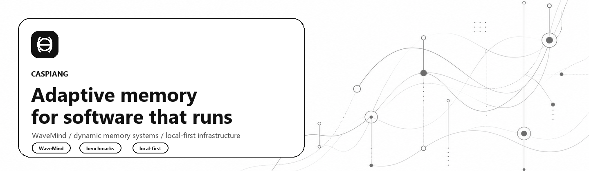
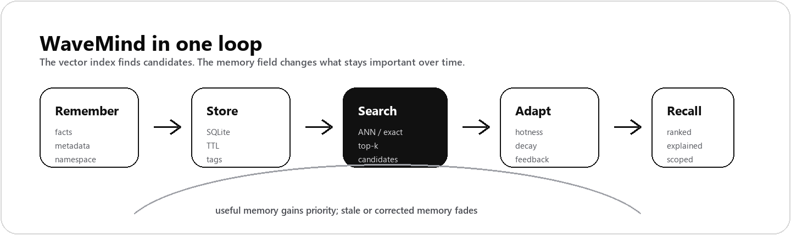

  

<h1 align="center">CaspianG</h1>

  <strong>Building memory infrastructure for software that needs durable context, adaptive recall, and clear evidence.</strong>

  
  
  
  

  <a href="https://github.com/CaspianG/wavemind"><strong>WaveMind</strong></a>
  &nbsp;&middot;&nbsp;
  <a href="https://pypi.org/project/wavemind/">PyPI</a>
  &nbsp;&middot;&nbsp;
  <a href="https://www.github.com/CaspianG/wavemind#user-content-quick-start">Quick Start</a>
  &nbsp;&middot;&nbsp;
  <a href="https://www.github.com/CaspianG/wavemind#user-content-benchmark">Benchmarks</a>
  &nbsp;&middot;&nbsp;
  <a href="https://github.com/CaspianG/wavemind/issues">Issues</a>

---

<table>
  <tr>
    <td width="56%" valign="top">
      <h2>Current Work</h2>
      

        I am building <a href="https://github.com/CaspianG/wavemind"><strong>WaveMind</strong></a>:
        an open-source memory layer for long-running applications, agents, notebooks,
        internal copilots, research tools, and systems that need context to survive
        beyond a single prompt.
      

      

        The core idea is simple: memory should not be a static vector lookup.
        Important memories should become easier to recall, stale facts should fade,
        corrections should suppress older context, and every recall should be
        inspectable.
      

      

        Current focus: scale, benchmark evidence, production readiness, graph recall,
        observability, and practical integrations.
      

    </td>
    <td width="44%" valign="top">
      <h2>Try It</h2>
      <pre><code class="language-bash">pip install wavemind</code></pre>
      <pre><code class="language-python">from wavemind import WaveMind

memory = WaveMind()
memory.remember("The user prefers concise answers.")

hit = memory.query("How should I respond?")[0]
print(hit.text)</code></pre>
    </td>
  </tr>
</table>

  

## What I Build

| Area | Focus |
| --- | --- |
| Dynamic memory | Hotness, decay, TTL, feedback, conflict handling, consolidation, and graph-aware recall. |
| Local-first infrastructure | SQLite source of truth, optional ANN indexes, simple APIs, offline demos, reproducible artifacts. |
| Production evidence | Benchmarks, latency profiles, packaging checks, CI gates, and documented limits. |
| Developer adoption | Small APIs, framework adapters, migration guides, issue hygiene, and contributor-friendly tasks. |

## Featured

| Project | What it is | Status |
| --- | --- | --- |
| [WaveMind](https://github.com/CaspianG/wavemind) | Dynamic long-term memory for agents, notebooks, internal tools, support systems, and products with durable context. | Active |
| [focus-flow](https://github.com/CaspianG/focus-flow) | Minimal desktop focus timer for deep-work sessions with English/Russian UI. | Stable |
| [CORECITY](https://github.com/CaspianG/CORECITY) | Browser game concept around a living market mechanic. | Public archive |

## Working Principles

- Build the useful path first, then prove it under real workloads.
- Keep local development fast, inspectable, and easy to run.
- Treat benchmarks, tests, packaging, and reproducibility as part of the product.
- Make forgetting, provenance, and namespace isolation first-class primitives.
- Avoid claims that do not have runnable artifacts behind them.

## Stack

  
  
  
  
  
  
  
  

## Open To

I am interested in practical memory systems, long-running software, retrieval
benchmarks, privacy-aware forgetting, production indexes, graph recall, and real
workloads where static vector search starts to break down.

Start with [WaveMind issues](https://github.com/CaspianG/wavemind/issues) if you
want to test an integration, benchmark a workload, or contribute an adapter.
