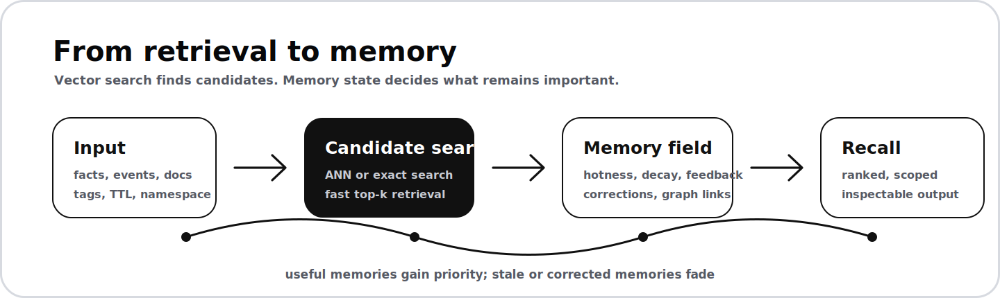

  

<h1 align="center">CaspianG</h1>

  <strong>Building adaptive memory systems for software that needs durable context.</strong> 
  Main project: <a href="https://github.com/CaspianG/wavemind"><strong>WaveMind</strong></a>, a local-first memory layer with retrieval, decay, priority, namespaces, provenance, and reproducible benchmarks.

  
  
  
  

  <a href="https://github.com/CaspianG/wavemind"><strong>Repository</strong></a>
  &nbsp;/&nbsp;
  <a href="https://pypi.org/project/wavemind/">PyPI</a>
  &nbsp;/&nbsp;
  <a href="https://github.com/CaspianG/wavemind#user-content-quick-start">Quick Start</a>
  &nbsp;/&nbsp;
  <a href="https://github.com/CaspianG/wavemind#user-content-benchmark">Benchmarks</a>
  &nbsp;/&nbsp;
  <a href="https://github.com/CaspianG/wavemind/issues">Contribute</a>

---

<table>
  <tr>
    <td width="57%" valign="top">
      <h2>Current Focus</h2>
      

        I am working on memory infrastructure that behaves less like a static
        vector search box and more like a living context layer.
      

      

        WaveMind stores facts, retrieves candidates, then applies memory state:
        hotness, decay, TTL, feedback, corrections, graph recall, and namespace
        isolation.
      

      

        The practical goal is simple: long-running software should remember
        useful context, suppress stale context, and make recall inspectable.
      

    </td>
    <td width="43%" valign="top">
      <h2>Try WaveMind</h2>
      
<strong>Install</strong>

      <pre><code>pip install wavemind</code></pre>
      
<strong>Run a local demo</strong>

      <pre><code>wavemind quickstart</code></pre>
      
<strong>Use from Python</strong>

      <pre><code>from wavemind import WaveMind

memory = WaveMind()
memory.remember("Andrey prefers concise answers")
print(memory.query("How should I answer Andrey?"))</code></pre>
    </td>
  </tr>
</table>

  

## Why WaveMind

| Static vector search | WaveMind memory layer |
| --- | --- |
| Returns nearest vectors. | Finds candidates, then re-ranks with memory state. |
| Old facts can keep winning. | TTL, decay, feedback, and corrections lower stale priority. |
| Context is hard to audit. | Results include metadata, provenance, and scoring signals. |
| Benchmarks often stop at top-k retrieval. | Tests include stale facts, namespace isolation, latency, and coherence. |

## Workbench

| Track | What is being built |
| --- | --- |
| Scale | ANN indexes, namespace sharding, cache-aware recall, and production load tests. |
| Memory OS | Background consolidation, forgetting policies, graph dynamics, and priority learning. |
| Benchmarks | LoCoMo, LongMemEval-style retrieval, agent coherence, latency curves, and competitor baselines. |
| Integrations | LangChain, LlamaIndex, HTTP API, CLI, Docker, and practical workflow examples. |
| Product surface | Local demos first, then tools for inspecting and debugging memory behavior. |

## Selected Projects

| Project | Focus | Status |
| --- | --- | --- |
| [WaveMind](https://github.com/CaspianG/wavemind) | Adaptive long-term memory for software with durable context. | Active |
| [focus-flow](https://github.com/CaspianG/focus-flow) | Minimal desktop focus timer for deep-work sessions. | Stable |
| [CORECITY](https://github.com/CaspianG/CORECITY) | Browser game concept around a living market mechanic. | Public archive |

## Stack

  
  
  
  
  
  
  
  

## Collaboration

I am interested in practical memory systems, retrieval benchmarks, local-first
software, privacy-aware forgetting, graph recall, production indexes, and real
workloads where static vector search starts to break down.

Start with [WaveMind issues](https://github.com/CaspianG/wavemind/issues) if you
want to test an integration, benchmark a workload, or contribute an adapter.
