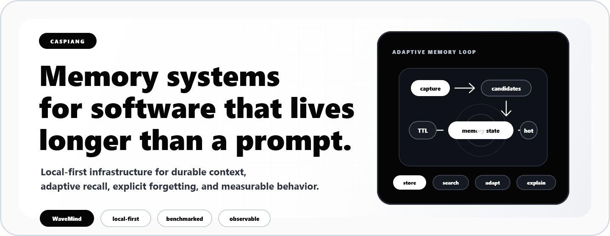
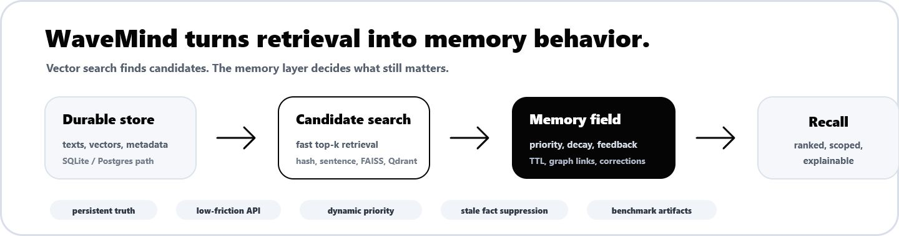

  

<h1 align="center">CaspianG</h1>

  <strong>Building local-first memory infrastructure for software that needs durable context, adaptive recall, and explicit forgetting.</strong>

  
  
  
  

  <a href="https://github.com/CaspianG/wavemind"><strong>WaveMind</strong></a>
  &nbsp;&middot;&nbsp;
  <a href="https://pypi.org/project/wavemind/">PyPI</a>
  &nbsp;&middot;&nbsp;
  <a href="https://github.com/CaspianG/wavemind#quick-start">Quick Start</a>
  &nbsp;&middot;&nbsp;
  <a href="https://github.com/CaspianG/wavemind#benchmark">Benchmarks</a>
  &nbsp;&middot;&nbsp;
  <a href="https://github.com/CaspianG/wavemind/issues">Contribute</a>

---

<table>
  <tr>
    <td width="55%" valign="top">
      <h2>Current Focus</h2>
      

        I work on systems that keep context alive after the first prompt, request, or session.
        The main project is <a href="https://github.com/CaspianG/wavemind"><strong>WaveMind</strong></a>:
        an open-source memory layer where vector search finds candidates and memory state decides what still matters.
      

      

        The direction is simple: useful context should become easier to recall, stale facts should fade,
        corrections should suppress old state, and every decision should be testable.
      

    </td>
    <td width="45%" valign="top">
      <h2>Try It</h2>
      <pre><code class="language-bash">pip install wavemind
wavemind quickstart
wavemind studio</code></pre>
      

        Python API, CLI, HTTP server, local Studio UI, persistent storage, vector backends,
        graph memory, workers, telemetry, and reproducible benchmarks.
      

    </td>
  </tr>
</table>

  

## What I Build

| Area | Work |
| --- | --- |
| **Adaptive memory** | Hotness, decay, TTL, feedback, graph recall, conflict handling, and explainable forgetting. |
| **Retrieval infrastructure** | Local-first search, persistent stores, ANN backends, benchmark gates, and latency profiles. |
| **Developer tools** | Python APIs, FastAPI, CLI, Studio UI, framework adapters, examples, and migration guides. |
| **Production evidence** | CI, release artifacts, reproducible benchmark reports, observability, and clear limitations. |

## Featured Projects

| Project | Status | Why it matters |
| --- | --- | --- |
| **[WaveMind](https://github.com/CaspianG/wavemind)** | Active | Dynamic long-term memory for agents, copilots, notebooks, support tools, and products that need durable context. |
| **[focus-flow](https://github.com/CaspianG/focus-flow)** | Public | Minimal desktop focus timer for deep-work sessions with planning, themes, and English/Russian UI. |
| **[CORECITY](https://github.com/CaspianG/CORECITY)** | Public concept | Browser game experiment around a living market mechanic driven by players. |

## The Thesis

Most systems can store context. The harder problem is deciding what context still deserves attention.

WaveMind is built around that gap: retrieval provides candidates, memory state changes ranking, and benchmark artifacts keep the behavior measurable.

## Stack

  
  
  
  
  
  
  
  
  
  

## Open To

| Collaboration | Good fit |
| --- | --- |
| **Benchmarks** | Long-memory evaluation, stale-fact suppression, retrieval quality, latency, and agent-impact tests. |
| **Integrations** | LangChain, LangGraph, LlamaIndex, CrewAI, AutoGen, local apps, notebooks, and product workflows. |
| **Production feedback** | Real systems where memory needs to evolve, forget, explain, or preserve user-specific context over time. |

## Contact

Open an issue in [WaveMind](https://github.com/CaspianG/wavemind/issues) if you want to test the project, contribute an integration, add a benchmark, or discuss adaptive memory for production software.
