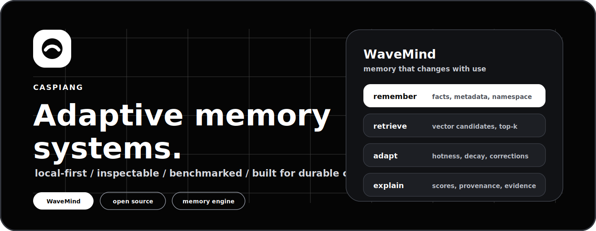
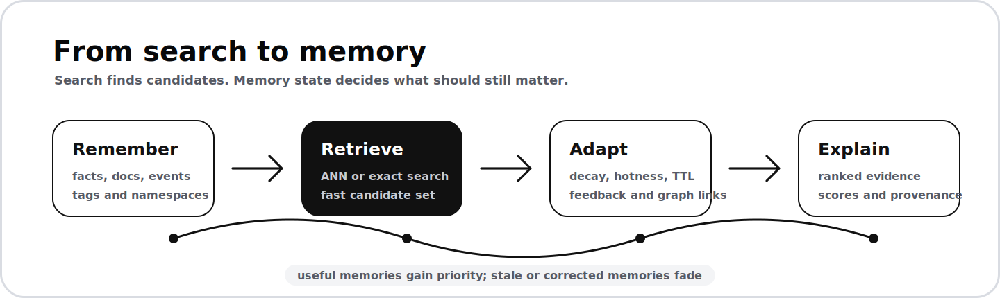

<p align="center">
  <a href="https://github.com/CaspianG/wavemind">
    
  </a>
</p>

<h1 align="center">CaspianG</h1>

<p align="center">
  <strong>Building memory infrastructure for long-running software.</strong><br />
  My main work is <a href="https://github.com/CaspianG/wavemind"><strong>WaveMind</strong></a>:
  a local-first memory engine where recall is shaped by freshness, priority,
  feedback, namespaces, and evidence.
</p>

<p align="center">
  <a href="https://github.com/CaspianG/wavemind"></a>
  <a href="https://pypi.org/project/wavemind/"></a>
  <a href="https://github.com/CaspianG/wavemind/actions/workflows/full-check.yml"></a>
  <a href="https://github.com/CaspianG/wavemind/releases"></a>
</p>

<p align="center">
  <a href="https://github.com/CaspianG/wavemind"><strong>WaveMind</strong></a>
  &nbsp;/&nbsp;
  <a href="https://pypi.org/project/wavemind/">PyPI</a>
  &nbsp;/&nbsp;
  <a href="https://github.com/CaspianG/wavemind#user-content-quick-start">Quick Start</a>
  &nbsp;/&nbsp;
  <a href="https://github.com/CaspianG/wavemind#user-content-benchmark">Benchmarks</a>
  &nbsp;/&nbsp;
  <a href="https://github.com/CaspianG/wavemind/issues">Contribute</a>
</p>

---

<table>
  <tr>
    <td width="50%" valign="top">
      <h2>What I am building</h2>
      <p>
        I work on systems that keep context alive after a single prompt, request,
        or session ends.
      </p>
      <p>
        The current focus is dynamic memory: not just storing vectors, but
        deciding which memories should stay important, which ones should fade,
        and which ones need evidence.
      </p>
    </td>
    <td width="50%" valign="top">
      <h2>Try the main project</h2>
      <pre><code>pip install wavemind
wavemind quickstart</code></pre>
      <pre><code>from wavemind import WaveMind

memory = WaveMind()
memory.remember("Andrey prefers concise answers")
print(memory.query("How should I answer Andrey?"))</code></pre>
    </td>
  </tr>
</table>

<p align="center">
  <a href="https://github.com/CaspianG/wavemind">
    
  </a>
</p>

## Main Work

| Project | What it does | Links |
| --- | --- | --- |
| **WaveMind** | Adaptive memory layer for software that needs durable, inspectable context. | [repo](https://github.com/CaspianG/wavemind) / [PyPI](https://pypi.org/project/wavemind/) / [benchmarks](https://github.com/CaspianG/wavemind#user-content-benchmark) |
| **focus-flow** | Minimal desktop focus timer for 50/10 and 90/15 deep-work sessions. | [repo](https://github.com/CaspianG/focus-flow) |
| **CORECITY** | Browser game concept around a living market mechanic. | [repo](https://github.com/CaspianG/CORECITY) |

## Why This Direction

Most software memory still behaves like a static search box:

```text
embed -> search -> top-k -> prompt
```

WaveMind is built around a different loop:

```text
remember -> retrieve -> adapt -> explain
```

The goal is memory that can be queried, corrected, scoped, benchmarked, and
audited instead of treated as an invisible prompt appendage.

## Current Focus

| Track | Direction |
| --- | --- |
| Scale | FAISS, sharding, service-backed load tests, and predictable latency. |
| Memory dynamics | Decay, priority, corrections, graph recall, consolidation, and feedback. |
| Benchmarks | LoCoMo, LongMemEval-style retrieval, stale-fact suppression, and competitor baselines. |
| Integrations | LangChain, LlamaIndex, HTTP API, CLI, Docker, and practical examples. |
| Product surface | Local demos and tools for inspecting how memory behaves. |

## Stack

<p>
  
  
  
  
  
  
  
  
</p>

## Collaboration

I am interested in retrieval, long-term memory, local-first software,
benchmarking, privacy-aware forgetting, graph recall, and production workloads
where static vector search is not enough.

If you want to contribute, start with
[WaveMind issues](https://github.com/CaspianG/wavemind/issues) or test the
quickstart on your own workload.
